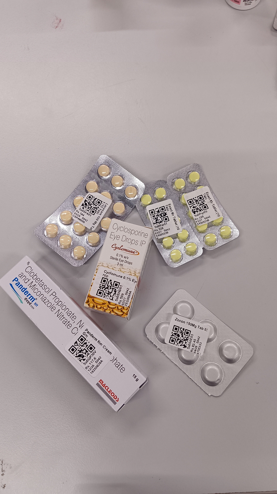
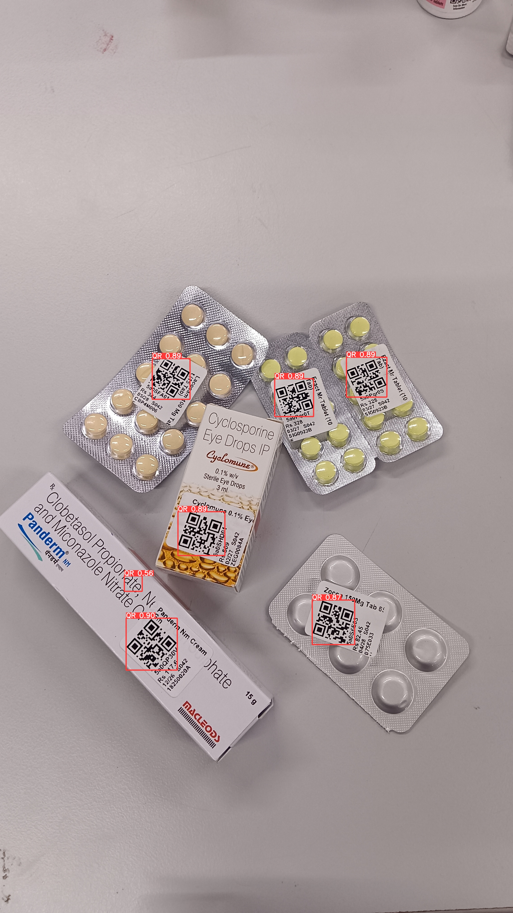
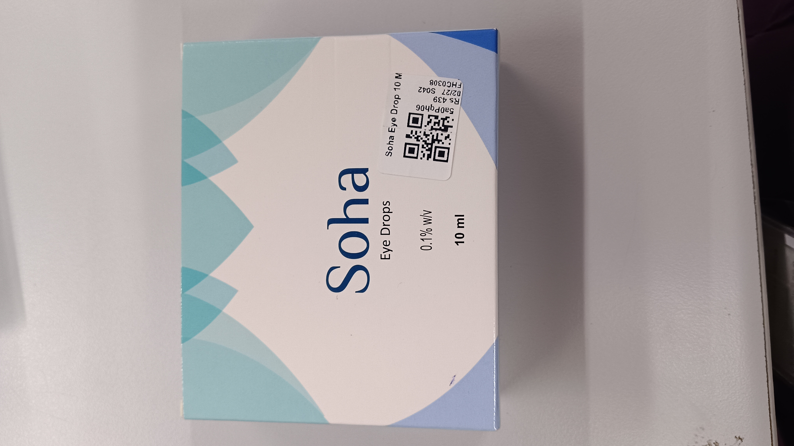
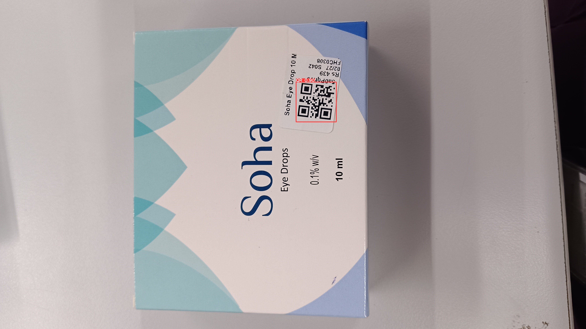

# Multi-QR Code Detection 

This repository contains the complete code submitted for the Multi-QR Detection Hackathon. The solution is built upon the YOLOv9 object detection framework and includes a model weights trained on QR dataset provided in the hackathon for immediate inference.

* The `outputs/` directory contains the `submission_detection_1.json` file, which has the detection results on the provided `test_images` in which it includes bounding boxes with confidence more than 0.55
---

## 1. Setup Instructions

Follow these steps to set up the environment and prepare the project.


### Installation Steps

1.  **Clone this Submission Repository:**
    ```bash
    git clone <your-github-repo-url>
    cd multiqr-hackathon
    ```

2.  **Clone the YOLOv9 Framework:**
    The core model code is required from the official YOLOv9 repository. The following command clones it directly into the `src/` directory, which is where the scripts expect it to be.
    ```bash
    git clone https://github.com/WongKinYiu/yolov9.git src/yolov9
    ```

3.  **Install Dependencies:**
    Install all the necessary Python libraries using the provided `requirements.txt` file.
    ```bash
    pip install -r requirements.txt
    ```

---

## 2. How to Run Inference (Using the Provided Trained Model)

A pre-trained `best.pt` model is included in the `trained_models/` directory. You can use it directly to generate predictions.

### Command Format
The inference script requires you to specify the input image folder, the output JSON path, and the path to the model weights.
```bash
python infer.py --input <path_to_images_folder> --output <path_to_save_json> --weights <path_to_model.pt>
```
---

## 3. Steps for re-training the model

### A. Data Preparation

1.  **Place Your Dataset:**
    Place your dataset (e.g., `QR_Dataset`) in the root of this project directory.
    > **Note:** The bounding box annotations for the training and validation images were created using the **LabelImg** tool and are saved in the required YOLO `.txt` format.

2.  **Generate File Lists:**
    Run the utility script to create `train.txt` and `val.txt`. These files contain absolute paths to your images, which YOLOv9 requires.
    ```bash
    python src/utils/prepare_data.py --path ./QR_Dataset
    ```

3.  **Configure the Dataset YAML:**
    You must tell YOLOv9 where to find your data. Open the `src/yolov9/data/custom.yaml` file and ensure it looks like this. The `prepare_data.py` script will print the absolute paths you need to use.

    ```yaml
    train: /path/to/your/multiqr-hackathon/QR_Dataset/train.txt
    val: /path/to/your/multiqr-hackathon/QR_Dataset/val.txt
    
    # Number of classes
    nc: 1

    # Class names
    names: ['QR']
    ```

### B. Start Training

1.  **Download Base Weights:**
    Our training script starts from YOLOv9's COCO pre-trained weights for faster convergence.
    ```bash
    wget https://github.com/WongKinYiu/yolov9/releases/download/v0.1/yolov9-s.pt -P src/yolov9/
    ```

2.  **Run the Training Script:**
    ```bash
    python train.py
    ```
    You can then use the new `best.pt` weights of the model for inference as specified in `Step 2. How To run Inference`

---

## 4. Example Inference Results

sample results of QR code detection using the provided demo images:

| **Original Demo Image** | **Detection Output** |
|--------------------------|-----------------------|
|  |  |
|  |  |
